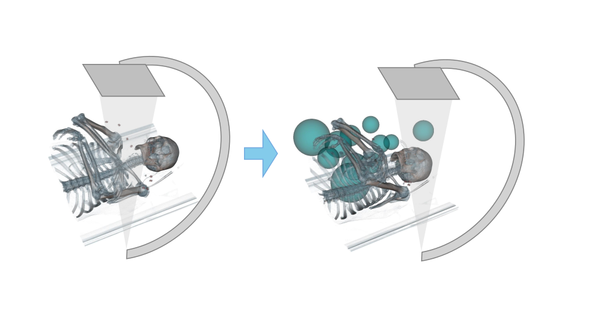

# C_arm_guidance_APAH
Official implementation of the paper "Automated C-Arm Positioning via Conformal Landmark Localization" (ICCVW APAH 2025)

## Model 🤖

## Interpretation 👨‍🏫

## Code Workflow 👨‍💻
1. **Train the Model**: Begin by training the model with your dataset using the script located at `src/train_landmark_regression.py`.
2. **Calculate Calibration Intervals**: After training, calculate the necessary calibration intervals using `src/calibration_interval_generator.py`.
3. **Test the Models**: Finally, test the models and obtain the test metrics with the script found at `src/test_landmark_regression.py`.

### Important Note 🚨
This repository is still **Under construction** 🚧 as we are resolving the issue of data not being open-sourced yet. For more details, please contact me at [ahmad.arrabi@uvm.edu](mailto:ahmad.arrabi@uvm.edu). We are actively working to make this adaptable to any X-ray data and defined landmark annotations.

