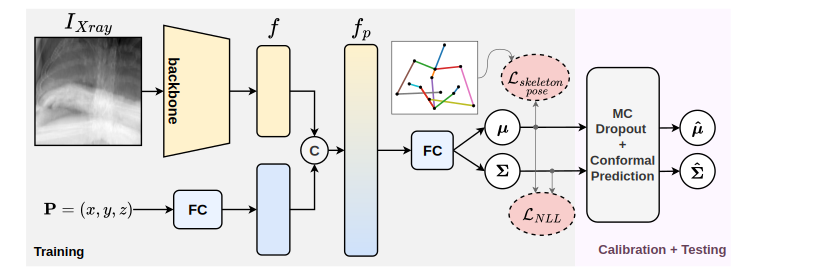

# Automated C-Arm Positioning via Conformal Landmark Localization

This repository provides the official implementation of our paper "Automated C-Arm Positioning via Conformal Landmark Localization" 🏆 Accepted at **[ICCV Workshop on Advanced Perception for Autonomous Healthcare (APAH), 2025](https://apahws.github.io/)**

## Model 🤖

  

## Interpretation 👨‍🏫

  

## Code Workflow 👨‍💻
1. **Train the Model**: Begin by training the model with your dataset using the script located at `src/train_landmark_regression.py`.
2. **Calculate Calibration Intervals**: After training, calculate the necessary calibration intervals using `src/calibration_interval_generator.py`.
3. **Test the Models**: Finally, test the models and obtain the test metrics with the script found at `src/test_landmark_regression.py`.

## Project Status 🚧
This repository is still under active development.
We are working on releasing a version adaptable to any X-ray dataset with defined landmark annotations.
For early collaboration or dataset access inquiries, please contact me at 📧 ahmad.arrabi@uvm.edu

